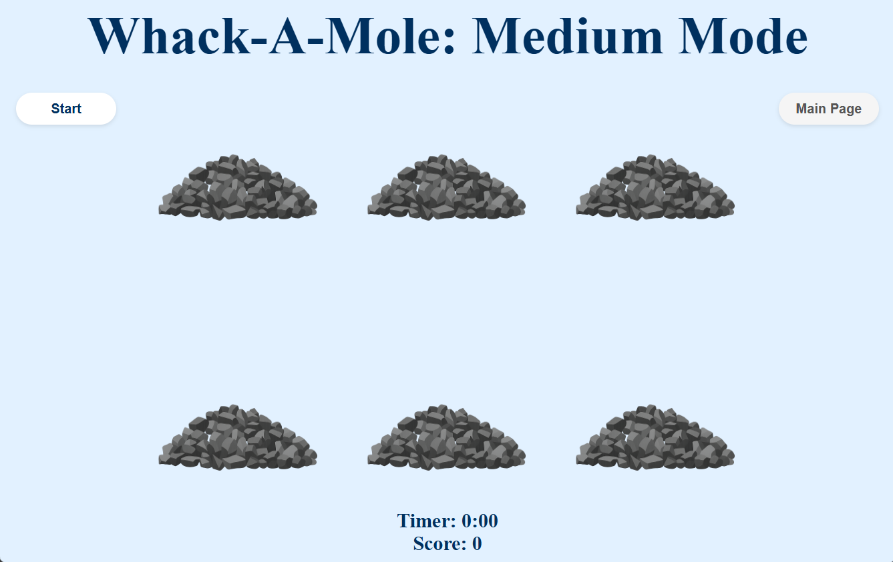
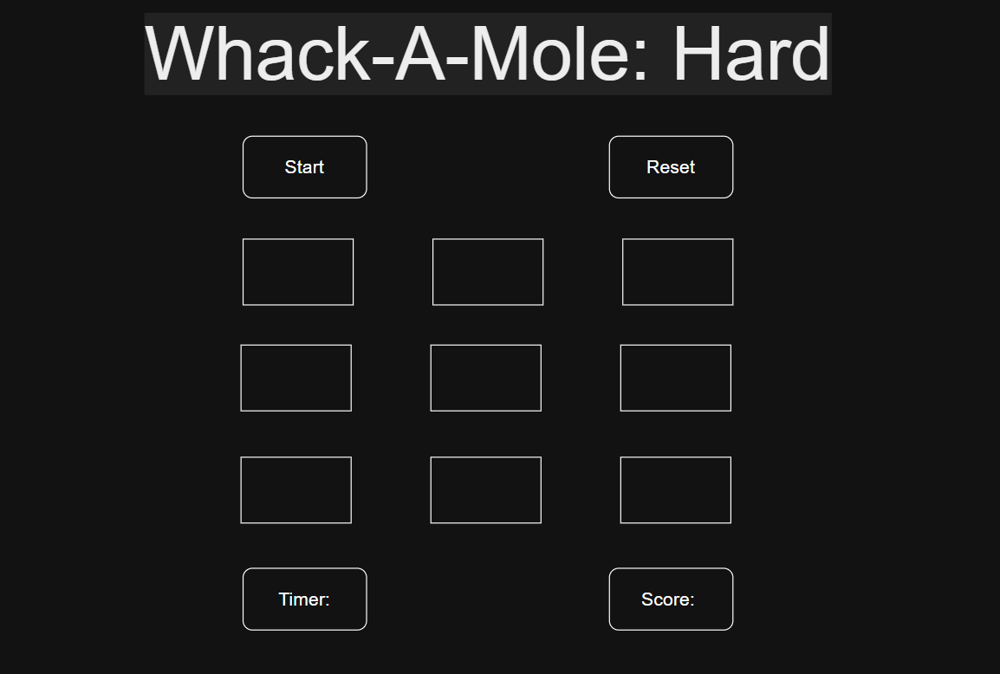

# Whack-A-Mole


## Description
Whack-A-Mole is a classic arcade-style game built with vanilla JavaScript, HTML, and CSS which consists of moles popping out of holes once at a time randomly and you have to click on each mole to score a point. The win/lose condition is that with every game there will be specific time and a number of moles that will pop out of each hole as long as the timer runs, if you hit 70% or more of the moles, you'll win otherwise, you'll lose. Test your reflexes as moles pop up from holes - whack them to score points before time runs out!

## Features
1. Three difficulty levels (Easy, Medium, Hard)

2. 90-second timed gameplay (10 seconds for Easy mode)

3. Win condition: Hit 70% or more of the moles

4. Detailed game statistics

5. Responsive design

6. Smooth animations and transitions

7. Modern modal interface for results

## How to Get Started
At first, we plan out and write down the to-do list in [Trello](https://trello.com/b/cWuKVxPa/my-trello-board), after that we create the layout of how we want the app to looklike on [Draw.io](https://www.drawio.com/). After that we write down the pseudocode and break down the tasks as much as possible going into detail so we can easily turn the broken down points into code.

The next step is creating the repository and adding the html, css, js and README files inside of the project directory. Starting with the HTML file, we add the boilerplate and link the other files with each other.

The last step is walking through the pseudocode and code each line while testing and troubleshooting along the way until the game is finalized.

## The Procedure and My Experience
As someone who was never interested in learning anything that has to do with IT, coding or development, I started this bootcamp to challenge myself into doing something I didn't really have a passion for so I can step out of my comfort zone.

Eventhough I learned a lot making this game, tried, failed, tried and failed again. I learned to never stop trying because if there is one attribute that I consider myself to have is perseverance and grit. I had absolutely no idea where to start making this game but as I took advice from my instructors, I started understanding a bit of the logic that goes behind making a game like this.

As I starting coding the game, I started to grasp the steps that goes into making something like this and I have to admit, I did enjoy it quite a fair bit. At first, I didn't want to make something overcomplicated but it is engraved within me to start wanting more so what I thought was going to be a breezy walk through the park turned out to just be a dream whilst riding a rollercoaster.

The more I coded, the more variables I had to define and add, the more complicated it got. Walking through everything step by step really helped me especially as someone who has never had prior experience with any software or language we were learning.

I started with initializing the game, I added the necessary buttons, headers and pages. As I coded the layout after making my layout on Draw.io, I added the modes and slowly I started with the functions, difficulty settings, time intervals, event handlers, the divs for the moles, the appearance and timeout, timers, score, win/lose conditions and modals. 

And when I thought I wouldn't be able to code a button, slowly the code grew little by little as I added the little pieces of the puzzle and went through multiple challenges while facing the great enemy (the game logic), I started to see that it wasn't just words that I was typing in vain but an actual, fully functioning game. Safe to say this marks one of my proudest moments because I created something I never thought that I was ever going to be able to do.

## Layout
This is to show the comparison between the initial frame and the final outcome of the game.

1. The main page


2. The rules page


3. The Easy Mode Game Page


4. The Medium Mode Game Page



5. The Hard Mode Game Page



6. The modal for the win/lose


## Links For My Own Work
1. [My GitHub Repository](https://github.com/Zahraa-06/Whack-A-Mole)

2. [My Draw.io Layout](https://viewer.diagrams.net/?tags=%7B%7D&lightbox=1&highlight=0000ff&edit=_blank&layers=1&nav=1&title=Layout.drawio&dark=auto#R%3Cmxfile%20pages%3D%225%22%3E%3Cdiagram%20name%3D%22Page-1%22%20id%3D%22b4dwUoESkQn_IdUHdA7p%22%3EzZbbjpswEIafhstIgAObXOa42baRKmWlbXvnYAesGIYak9PTd8BOgKZbbZXuKjfY%2Fmf8Y%2BazLRwySQ%2BPiubJEhiXju%2Byg0Omju97%2FgPBplKORgn6rhFiJZiRWsJKnLideVZLwXhhNSNpAKlF3hUjyDIe6Y5GlYJ9N20DknWEnMb8SlhFVF6rL4LpxKqe6zaBBRdxYl89CGwgpedkKxQJZbBvSWTmkIkC0KaXHiZcVsXr1mX%2BSvSyMMUz%2FZYJYrGj20%2FBgpw2%2FfDrfPr8w1M967KjsrQf7PihRL%2FxBtAWV62PthThzxLOgV5RgxphwoOfI%2BxxE8deXLUvCY22vVFvCWhgTXF1xtek2MJcXuFrfqj0RKcSBQ%2B7VIo4w36EX8kVCjuutEA%2BIxtIBWPV9LHiuCi6rq1cHOcgMl3TD8ZOMK28Sg1m4bV1oRVs%2BQQkoO80g6xy2Qgpf5OuC32uGi6FH1qSLfwjh5RrdcQUGyVuYKbYU%2BAHAzPeN3uqP7QbJWltp6HNo3YbxxfrhjR2LOx%2FAB%2FeDN4bvAJ%2BkgAUiNz9DqXC5gvf1ZfCM%2BBjpamq%2BNM0x9RsXeRm5pu2h4IyY5xZfvtEaL7KaVRF93j9dHfOf8E27GDre%2F1rbIM%2FYAvd27Et0ykRn0%2FfgkSqpzl5iqO195fzWuQ0uwnbjBbHFgjjd6cgAuJfgfD8jwThv9%2F5WXImyvRez8TlmrobFOT9UCyoYvcKIgw%2F7kzgsPlRqWOt3z0y%2BwU%3D%3C%2Fdiagram%3E%3Cdiagram%20id%3D%22mNXCKiZbvG_4cuGOL2oM%22%20name%3D%22Page-3%22%3E7VjbUtswEP0aP5Kxpdx4JCbADOWhDdNOHxVbiV1kyZHlXPj67tqyiZOmJEDaQDsD4%2BTserU6e1Zex6F%2BsrzWLI3uVMiFQ9xw6dBLhxCv33fhgsiqRM77pASmOg5LyH0CRvEjt3dWaB6HPLNYCRmlhInTJhgoKXlgGhjTWi2abhMlwgaQsinfAkYBE9votzg0kUU9130y3PB4Gtml%2Bx1rSFjlbIEsYqFarEF06JCuQ%2BiSOXTgINb8o75WyjzrVjknS58LJL%2FJ69XLA9R711yaN4o56%2FXY5HNCbkbfcnFLuAx%2BPJ7ZheZM5JZ2iC5gycFEwcrAnVnZgnRnuaoMZ1khlwtw8PrpssikssOnKV6HLFuBHYVZxYT8y7Clh61OvQLRKpchx3w9MC%2Bi2PBRygK0LkDkgEUmEdZsM%2Bfa8OVO1rx9yr1J3DVXCTcas7eRqUvL2Kuqu6y0FmvKrOQWrYmyazFmm2Fahz6omOBr6%2Fm25SfHK%2F%2BABQ8fru5d72PUnb667rS7o%2B5fcoFPjYudtS%2FhMJ5vQmO9icC9Db8N2YAATFMbTMRTCZ8DEALXAKBMYnimXFhDEoch3j7QHPbCxkUo4G2QqliaolidgdO5xFi5UeV%2Bi9CZ0eqB%2B0ooiHsplcQok1iIDehvypP0vP3k2TttebaPdyx5LbB%2BVzkSwuYcXeE%2FiWVu8ItRWCnBkGQTITJlCW8dLuYq0WqsqvKg2yn9Vv8HLvdiXgjycl%2BIq%2BAAzuBSHzhPSYQThY1tsVXBYMDkc9RstvDxdnAwjX8uNdq6V0VXSof4NXtWf2t0J0oXSMTA0cUm7cBVTWoxVjUAD%2FRPVYr23Pyvwh6ptVtXcFATl7Mggovgc3xj8mtys5TDDFKT22S8phrPLhlozrKyGyTc0mUJDilynKWntOFyByyB6cpUOoqaCtq9STXBE%2BFTSVJxSEZF57efgvgnu3NbW5fUaXcbaZdlqySAT1Hrdl65vaKjfpH3gX2yH0v73vriKUrwCVr%2BrRmKds63ZqhOp709QxFKT2WIumfDOzmc9bNJfpt%2F9bU3nvFjvtr74AcT0%2Ft%2Fr%2B%2FR3jt5vyt8n%2FlVysZb%2Bz2QDn8C%3C%2Fdiagram%3E%3Cdiagram%20id%3D%223nl2IWPAhpFgnGuMB4n8%22%20name%3D%22Page-2%22%3E3Vhdb9owFP0te4i0PkTKRwnpY2lpO0ZXrfRD28tkEpO4cezUMQT26%2BfENnOA0m1qJ0BCSnLuzfX1PcfXJpZ%2Fls8vGSjSaxpDbHlOPLf8c8vz3K7ni0uNLCRy4jgSSBiKJWQAI%2FQTqjc1OkUxLBUmIU4p5qhogxElBEa8hQHGaNV2m1Act4ACJHANGEUAr6OPKOapQl09jdpwBVGSqqHDjjLkQDsroExBTCsD8vuWF1iePweW37NqrP3zzxil%2FFU37ZzPzyCui9%2Bu68W%2FB1jOnUHC3yhm%2Bh3cFTeT0bAf%2BhlNfsy%2B3j3brhppBvBU1V3VjC80EYxOSQzrKCJur0oRh6MCRLW1EtITWMpzLJ7cJqMmHGQczl%2Bci%2FsnJKxO5xLSHHK2EM8qsu%2BqZJXC%2FUBJvjL0EiosNaRyooQBlESTZei%2FKrHwVVV%2BY1K8DaQEWCTfm1BRQ5Od4HlKtcEum0V8KhzcsJg3qWi7uEvq64gDxnU0MQEZUNq2MO%2FuNvPe8ck683r5m8wHO8P8wwWqBk%2F028VXXA1AAEPsjO1Nq%2FGNiL%2BFJdx%2F4oMg3Hfis6fxoB%2FeTvudQW8%2B%2FAxZPOxuIb4sANlIfEQxZZJ0low%2FiuFEdo6%2BHMmsGnVMQI7wQrpeQTyDHEXAsP9WT9dT6lEGOWhtIZTlABu2GWAIiCtGCeBTVp8UtvpFoHjJpVI81cZjx5EWDDmHzBbTjxBJ1t%2BkrEgBUSE9iQkBchsJ5RIVzdHTaSyciRcmIoaORqC0CvE0xxUjVEVZ3B58GUvkO86QCFfHLDmjGbSV%2FFp%2BzbJpYixrqBaPuB%2BDKEuaZWavECm2McmheXNkTCOGEWWAI0psnqIoI7BUuSOCONIFWvU1yNzqZ6TT8ptgCvhq5WJUFhgstDtGwuA5H1BeUMYB4Rtb0WMqJm%2Bf2tdUJ9QH5cLoTVLzL%2FSmOt%2FXmxIQuiTiPhJagOw%2Fdyk3DFpdytXbldGlut7JepdynXBX2tTDTfyUfTm170k5TMmn7Pz6nr3n%2FjQSApQ%2BAchrMsm4lGvlwLasINi7LWujFt7xkHqHcihb0J5zv3pOPRTu%2FQP619hxg33717iRk84ecxI4nYPkJDggTnb360rj%2B8oXOxXP%2BFbq938B%3C%2Fdiagram%3E%3Cdiagram%20id%3D%22t2dbhhAVppVlS7pz1cAz%22%20name%3D%22Page-4%22%3E3VnbjpswEP2WPiB1H6i4BEIe95JmW2nVS9ru9qlywAErxqbG2ZB%2BfQdsshDIblvtViFSJMiZ4Xg8ZzzYieFepsVMoCy54RGmhmNFheFeGY5jB4EFlxLZKmQSOAqIBYkUZD0Ac%2FIL6ydrdE0inGtMQZJzKknWBkPOGA5lC0NC8E3bbclp1AIyFOMOMA8R7aK3JJKJRm3LejBcYxIneujA04YU1c4ayBMU8U0DcqeG4xuOWyDDvTBKrP1xLwXn8km32jktLjEtk9%2FO69t%2FJ9jNXWAmn4nTPy%2FGS%2FFjdjUv7mbv0fepT1amHuge0bVOu06Z3NY6CL5mES5JgPZikxCJ5xkKS%2BsGKg%2BwRKYUvtlVQBUdFhIXB6di%2F4kG%2B7OZYZ5iKbbwXTO79khx6wJ3J3qsTaNcnInCkkaljHVdIF2h8Y76rzIMvjrJz6uJ06OJTyH2iyWHFDbF8X%2BueW0w82oJn4ODHWRFFUlth7u4vM4lErJmg%2FgVobI9Irx9bMI7LeGd0aRHeKsrvH%2FcwrsvJ%2FxnnOPhC%2B%2F7wUkKPzoofJ4h1it8yCkXSnQRL17DcBCdVV%2FOVFRVdSxRSuhWuV5jeo8lCVHD%2FlA9Y0dXjzaoQUsL4yJFtGG7R4IguFISI7kW5T7hUb8QZYdcNlqn0jiyLGWhWEosTJh%2BSFjcfZKLLEFMUzoKgwKUJoHKZZrNqqdTWaSAB5bAUbMxrKxQPNVmpUG14SJqD77jgngXKwJ0JWcuBV9hU5dfy69aNhXHLod68cD9AoWruFpm5p6QjusrDZs3Z41pRDjkAknCmSkTEq4YznXshBFJ6gTt%2BzbEfNSvEU7Lb0k5kvuZi0ieUbSt3SkBg2O9ImnGhURM9rai2wQmb56bN7wO6AZHZJ02upOq%2BgPdqYz46baEoDIZ3IdQDVj85z5lj9ovKNsOOn0qsMfdPmVbwVE3Ku8FtyZQgsrHR2kpJlvkarWc2EvL90%2FjpeW%2FXC18ISlWTWjg2u%2FvVAeo%2Ffvrb58md9v14t3Hr9z7ICZTkw362DgKvDfe0A%2BOvar0HRyHoorvjU9Sk74z3VA02f%2BBxau3LAPXpO%2B4NRRNut3rVFTp21sORZX97nW8mlS%2BT%2Fy6rfka%2Fyu4098%3D%3C%2Fdiagram%3E%3Cdiagram%20id%3D%22iAW1QBcU3sJCpQeuCbpb%22%20name%3D%22Page-5%22%3E3Zndb5swEMD%2Flj0grQ9MYAJJHtOuHw%2BrJi2V%2BuyAA1aMTY1Tkv31O7DJ%2BEq7Te1UkCoBd8f5fL%2Fz2TSWd5UebiXOknsREWYhJzpY3lcLIXeOPLiUkqOWLB1HC2JJIy1qCNb0JzFv1tI9jUhuZFqkhGCKZm1hKDgnoWrJsJSiaJttBYtaggzHpCdYh5j1pY80UomRuvU0SsUdoXFihl74RpHi2tgI8gRHomiIvGsLBRbyDtjyLq1S1v7zrqQQ6lWz2jg9XBFWJr%2Bd15t%2Fd3CauyRcvZHP77e75OFGBPGuCJ%2Be1vcr9e1gIz3QM2Z7k3bwzmDIy62AkSF36miABE97USvsvCqXFRi4i%2BxQRVLr4S4ur2uFpaq9QeTaodYZLiffSIo9j0gZqQvqIqGKrDMcltoCyhtkiUqZUZuYiVTkcDZf7p%2BA7qbsloiUKHmEZ%2BPZc80yMqsIzZb6uWjUZF1oSaMcAyPDZhnEJ9d%2FhRFsDcm3Be%2B9H%2FgfJCfjBx8Ey0mCn50Fn2eYD4IPBRNSQ5fx5jMMB9E59eVCR1VVxxanlB216R1hz0TREDf0v6tnjkz1GIUetNRwIVPMGrpnLCmGK6MxVntZ7kkv2oU4O2dSGE6lcgYzqDSMKEWkDdMPKY%2F7bwqZJZgbl0jLoACVTaFyufHm1NOpNErCC1vwUXvjRGuheKqNseGqEDJqD37yBfFudhTclT5zJcWO2Kb8WnbVsql8nHJoFg%2Fcb3C4i6tlZndAIi%2FQDJs3F41pRCQUEisquK0SGu44yU3slFNF6wR1bRswX7RrhNOy2zKBVTdzEc0zho%2B1OaOgQM4nmmZCKszVYCt6TGDy9sq%2BF3VAd1hGjd6ka%2F5Mbyrjfb0pYahLDvch1AKR%2F7lLwQb1xW%2F1Kdft96nA9%2Ft9ynUWH7pR%2Be94NIES1DYBTkucfJPr1TKxTev0PPJNK3i%2FWnigKdFNaOTsuyfVqbBfDrA%2Fy8T5aEzcFhM%2FcPtMnPkAk9mHZuIOfTeOBcps6Xf2zMlgGfqqGwuWYOFME8rQF9dYoHQb2MxH04AydLocC5R%2BA5sMlqGD3liwdBvYZKDMRwyleyr2hv6NN0YoixFDmS3nnQY2GSxj%2FloJFmgkUCrbV36jM%2F4av456178A%3C%2Fdiagram%3E%3C%2Fmxfile%3E)

3. [My Trello Board](https://trello.com/b/FzANAwKF/zahraas-whack-a-mole)

4. [My Game's Website](https://whack-a-mole-z.surge.sh/)

## Pseudocode
```javascript
// 1. Initialize DOM elements

// 2. Game state variables and difficulty settings.

// 3. Gameboard setup and mole appearance logic.

// 4. Game Timer, start and end game functions.

// 5. Eventhandlers, buttons, main execution.
```
## Technologies Used
1. JavaScript

2. HTML

3. CSS

## Next Steps
1. As an improvement, instead of the mole toggling between the rock I can have it pop up animatedly from behind the rock.

2. We can have power ups (time freeze, score multiplier) 

3. Special moles (a golden mole that counts for 5 points or bomb mole that makes you lose points)

4. Progressive difficulty that increases the speed the more the time goes on or randomize the appearance intervals of the moles.

5. Combo systems with visual pop ups and animations for consecutive hits.

6. Adding audio, special effects

7. Saving the scores and tracking high scores

8. Mobile optimization

## Credits
For the credits, I used [DeepSeek](https://www.deepseek.com/en) to generate ideas for the browser game to choose one and I'm going to use [Whack-A-Mole](https://whack-a-mole-js.netlify.app/) as a reference and inspiration. I also used [Claude](https://claude.ai/new) to help with debugging and researching new coding techniques to add. For research I also cross referenced [MDN](https://developer.mozilla.org/en-US/) and [W3 Schools](https://www.w3schools.com/).